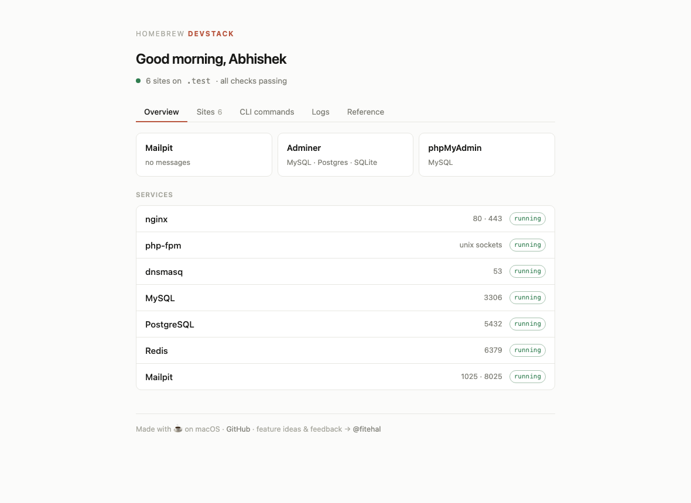

# ☕ brew-dev-stack

[](https://github.com/deshabhishek007/brew-dev-stack/actions/workflows/lint.yml)
[](https://github.com/deshabhishek007/brew-dev-stack/actions/workflows/install-test.yml)

**Your entire local PHP environment in plain files you can read.**
One `install.sh` on top of Homebrew. No app owns your ports, no privileged helper,
nothing listens beyond `127.0.0.1`.

| | |
|---|---|
| **Web** | nginx · trusted local HTTPS via mkcert · `*.test` DNS via dnsmasq |
| **PHP** | 8.2 / 8.3 / 8.4 / 8.5 — switchable globally **or per site** · Xdebug (trigger-based) |
| **Databases** | MySQL · PostgreSQL + pgvector · Redis · Adminer & phpMyAdmin UIs |
| **Sites** | one-command **WordPress**, **Laravel** or plain PHP — database (MySQL **or Postgres**), config, certificate included |
| **Mail** | Mailpit — every `mail()` captured, nothing can reach a real inbox |
| **Laravel** | managed `queue:work` and `schedule:run` workers per site |
| **Webhooks** | Cloudflare quick tunnels — public URL, no account, hostname rewritten on the fly |
| **Cockpit** | read-only dashboard at `https://devstack.test` · `devstack` CLI · `--json` for scripts |



## Sixty seconds after installing

```bash
devstack new blog                 # a full WordPress: database, config, admin login
devstack new api --type=laravel   # composer create-project, .env wired, migrated
devstack tunnel blog              # a public URL for Stripe / GitHub webhooks
devstack php 8.2 --site=legacy    # pin one site; every other stays on the default
devstack logs blog                # its debug.log, live
devstack creds blog               # forgot the database password? here it is
```

Every directory under `~/sites` is already serving at `https://<name>.test` with a
certificate your browser trusts:

```
~/sites/blog        →  https://blog.test
~/sites/shop        →  https://shop.test          (Laravel: serves shop/public)
~/sites/anything    →  https://anything.test
```

## Why this exists

It grew out of cleaning up a real machine: years of Valet-then-Herd leftovers — a
root php-fpm daemon from an uninstalled tool, a dnsmasq chain pointing into an empty
directory, TLS still served from a CA of a tool abandoned two migrations ago. Those
tools work, but they own ports 80 and 443, install root helpers, ship their own PHP
builds — and when you leave, the leftovers stay, invisibly, for years.

Here the same conveniences are plain configuration you own:

| Layer | Package | Config |
|---|---|---|
| DNS for `*.test` | `dnsmasq` | `$(brew --prefix)/etc/dnsmasq.d/test-tld.conf` |
| Web server | `nginx` | `$(brew --prefix)/etc/nginx/servers/local-dev.conf` |
| PHP, per site | `php@8.x` | `$(brew --prefix)/etc/nginx/php-versions.map` |
| TLS | `mkcert` | one certificate, one SAN per site |
| Mail | `mailpit` | `sendmail_path` redirected — nothing escapes |
| Databases | `mysql`, `postgresql` | tuned for a laptop, not a server |

Also there when you want them: `wp-cli`, `composer`, `phpmyadmin`, Adminer, Xdebug,
Redis, `pgvector`, Cloudflare quick tunnels, and managed Laravel queue/schedule
workers.

Everything comes from Homebrew except two things, both by necessity: **Adminer** (no
formula exists — fetched from adminer.org and verified before installing) and
**WordPress core** (fetched by `wp-cli` when you create a site).

Nothing is hidden. `brew upgrade` maintains the rest.

## Install

```bash
git clone https://github.com/deshabhishek007/brew-dev-stack.git
cd brew-dev-stack
./install.sh
```

See exactly what it would change first:

```bash
./install.sh --dry-run
```

The installer links `devstack` into Homebrew's bin, so the command works from
anywhere afterwards — no alias, no PATH edits.

Then follow the three printed steps (they need `sudo`, so the script does not run
them for you): trust the CA, add the resolver file, start the services.

Options — `./install.sh --help` lists them all:

```bash
SITES_DIR=~/code TLD=localdev PHP_VERSION=8.4 ./install.sh
WITH_MYSQL=0 WITH_PHPMYADMIN=0 ./install.sh
```

## Creating a WordPress site

One-time, so sites can be created without prompts afterwards:

```bash
devstack config     # your name, email, admin username → ~/.config/brew-dev-stack/config
```

Then, per site:

```bash
devstack new myblog                    # WordPress (default)
devstack new myapp --type=laravel      # Laravel
devstack new thing --type=plain        # empty PHP project
```

Every type gets a database and a **dedicated database user** — not root, so one site
cannot drop another's data — plus a certificate entry for its hostname.

| Type | What you get |
|---|---|
| `wordpress` | core downloaded and installed, `wp-config.php` with debug logging and `WP_ENVIRONMENT_TYPE=local`, pretty permalinks, and a generated admin password shown once |
| `laravel` | `composer create-project`, `.env` wired to the database and `APP_URL`, migrations run |
| `plain` | a `public/` docroot with a starter `index.php`, and the credentials in `README.md` |

## Where your settings live

`SITES_DIR`, `TLD` and `PHP_VERSION` are chosen at install time and recorded in
`~/.config/brew-dev-stack/config`, so every command afterwards uses the same values.
Environment variables still override them for a single invocation.

```bash
SITES_DIR=~/code TLD=localdev ./install.sh   # recorded, not just used once
```

## Managing sites

```bash
devstack list
```

```
SITE              TYPE            DOCROOT  REPO                        URL
shop              Laravel         public/  you/shop                    https://shop.test
api               PHP (composer)  public/  you/api                     https://api.test
blog              WordPress       root     you/blog                    https://blog.test
phpmyadmin        PHP (composer)  root     -                           https://phpmyadmin.test →link
```

Type is detected from what is on disk (`wp-config.php`, `artisan`, `bin/console`,
`composer.json`), and the repo column only reports a repository **rooted at that
directory** — without that check, a symlinked site walks up the tree and reports
whatever repo happens to contain its target.

```bash
devstack rm oldsite                    # files + database + db user
devstack rm oldsite --keep-db          # keep the data
devstack rm oldsite --keep-files       # keep the code
```

`rm` shows exactly what it will delete, warns about uncommitted or unpushed git work,
and requires you to type the site name — `y` is too easy to hit by reflex for something
that drops a database.

## Database administration

```bash
devstack install adminer
```

Installs [Adminer](https://www.adminer.org/) at `https://adminer.test` — a single PHP
file that administers **MySQL, PostgreSQL and SQLite** through one UI. It is served by
the stack you already have, so it costs nothing when you are not looking at it.

That matters for PostgreSQL specifically: pgAdmin is an Electron application that stays
resident, which is a poor trade on a machine with limited RAM.

| | |
|---|---|
| MySQL | system `MySQL`, server `127.0.0.1`, user `root`, no password |
| PostgreSQL | system `PostgreSQL`, server `127.0.0.1:5432`, your macOS username |

Homebrew's PostgreSQL trusts local connections by default, so no password is needed.
phpMyAdmin remains available at `https://phpmyadmin.test` if you prefer it for MySQL.

### PostgreSQL and pgvector

```bash
WITH_POSTGRES=1 WITH_PGVECTOR=1 ./install.sh
```

`PG_VERSION` defaults to **18**. This matters: Homebrew's `pgvector` bottle is built
only against recent PostgreSQL majors, so installing it next to an older postgres
*appears to succeed* and then `CREATE EXTENSION vector` fails with "extension not
available" — a confusing failure, because nothing errored at install time.

## Catching outgoing mail

```bash
devstack install mailpit
```

Every WordPress and Laravel site sends mail. Without a catcher, PHP's `mail()` hands off
to the system MTA — on macOS, postfix — which attempts **real MX delivery**. It usually
fails from a home connection, but it fails *silently*, and "usually" is not "never". A
local test of a password reset or an order confirmation can reach a real person.

Mailpit fixes that at the stack level rather than per site:

| | |
|---|---|
| Inbox | `https://mailpit.test` |
| SMTP | `127.0.0.1:1025` |
| Bound to | **127.0.0.1 only** — captured mail contains password-reset links |

`sendmail_path` is set once in `php.ini`, so **every** PHP application is captured —
WordPress included, with no plugin. New Laravel sites additionally get `MAIL_*` written
into `.env`, so queued mail and mailable previews work natively.

Homebrew's own `mailpit` service is deliberately not used: it passes no arguments, so
mailpit listens on every interface, and brew rewrites its plist on each `brew services`
call, so the bind flags cannot live there.

## Debugging

```bash
devstack install xdebug
devstack logs php          # PHP errors
devstack logs mysite       # a site's WordPress debug.log
devstack logs all          # nginx and PHP together
```

Xdebug is configured with `start_with_request = trigger`, so it stays dormant until you
ask for it — always-on step debugging slows every request noticeably. Trigger with
`?XDEBUG_TRIGGER=1`, or a browser helper extension. It listens on port 9003.

**Xdebug is not in Homebrew.** It is a `pecl` build tied to one PHP version, so it lives
outside `brew upgrade` and must be rebuilt after `devstack php <ver>` — the command says
so when it finishes.

New sites also get `WP_DEBUG` / `WP_DEBUG_LOG` (WordPress) and `.env` debug defaults
(Laravel), and PHP errors are written to `$(brew --prefix)/var/log/php-error.log`.

## Redis

```bash
devstack install redis
```

Installs Redis, binds it to 127.0.0.1, and builds the **phpredis** extension — Laravel
can fall back to the pure-PHP `predis` package, but WordPress object-cache plugins need
the extension. Use a different `REDIS_DB` per site to keep them apart.

## Laravel workers

```bash
devstack queue myapp on        # queue:work as a managed agent
devstack schedule myapp on     # schedule:run every minute
devstack queue myapp           # status
```

Both run under launchd, survive logout, and log to the site's own
`storage/logs/devstack-{queue,schedule}.log`. The queue worker uses `--max-time=3600`
so it recycles hourly — a long-lived worker otherwise keeps running stale code after
you edit a job. Workers honour a per-site PHP pin, so they run the same version as the
web requests.

## Public tunnels for webhooks

```bash
devstack tunnel myapp
```

Opens a Cloudflare quick tunnel — a random `trycloudflare.com` URL, no account needed,
gone when you press ctrl-c. This is how you test Stripe, Twilio or GitHub callbacks
against a local site.

It prints the address and nothing else — cloudflared's own output is ~30 lines of
connectivity pre-checks that bury it. Anything at warning level or above still shows.

**This makes the site reachable by anyone with the URL.** Local sites often run with no
credentials — do not tunnel one holding anything you would not publish.

### Why tunnelled sites are not broken

WordPress stores absolute URLs in the database — `siteurl`, `home`, and inside post
content. Laravel has `APP_URL`. Reached on a tunnel address, a site would emit asset URLs
for its `.test` name, which the visitor cannot resolve: the page loads completely
unstyled.

The tunnel vhost rewrites the local hostname out of every response with `sub_filter`, so
**nothing in your site or database changes**. It also catches URLs baked into post
content, which `WP_HOME`/`WP_SITEURL` cannot reach.

Three rules are generated, and the order matters — `//site.test` is a substring of
`http://site.test`, so the scheme'd forms are replaced first. WordPress emits the
protocol-relative form for its `dns-prefetch` hint, which a rule for `http://` and
`https://` alone would silently miss.

`Accept-Encoding` is cleared, because `sub_filter` cannot rewrite a compressed body: if
PHP gzips its own output the substitution quietly does nothing. The vhost also sets
`HTTPS on`, since Cloudflare terminates TLS and forwards plain HTTP — without it the app
emits `http://` assets onto an `https` page and browsers block them.

## Dashboard

Once installed, open **`https://devstack.test`**.

Four tabs, each a single screen:

| | |
|---|---|
| **Overview** | anything down, a live tunnel with its public URL, the tools, and every service with its port and running state |
| **Sites** | all of them, searchable — each with its HTTP status code as a visible badge, a per-site count of recent PHP errors, its PHP version when pinned, and any running workers |
| **Logs** | the last 120 lines of the PHP, nginx error, nginx access or php-fpm log, newest first, with a filter box — reading logs is read-only by nature, so it belongs here |
| **CLI commands** | why the page is read-only, the current default values (sites dir, TLD, PHP version), and the full reference parsed from `devstack help` so it cannot drift from the CLI |
| **Reference** | each layer, its package and config path, and the reasoning behind the non-obvious decisions |

Your own projects only — `devstack`, `adminer` and `phpmyadmin` are this stack's tooling
and belong under Tools, not in a list of your work. Directories with nothing servable in
them are left out too. Health checks appear **only when something is wrong**.

Every site is checked over HTTP in parallel, so a site returning 500 does not look
identical to a healthy one. **401 and 403 are treated as protected rather than broken**,
and 404 at a root is often deliberate for an API — only a server error or no response at
all raises an alarm.

PHP errors from the last day are attributed to the site whose path appears in them and
shown as a count on that site's row — an error belongs next to the thing that produced
it, not in a global feed.

A live tunnel is called out with its address, read from cloudflared's own
`/quicktunnel` endpoint, so it works for a tunnel that was already running.

It is **read-only by design**.## Machine-readable output

```bash
devstack list --json
devstack doctor --json
```

```json
[
  { "name": "shop", "type": "Laravel", "docroot": "public",
    "repo": "you/shop", "url": "https://shop.test",
    "path": "/Users/you/sites/shop", "symlink": false }
]
```

`doctor --json` returns `{status, message}` per check, where status is `pass`, `warn`
or `fail` — so a script can act on the result rather than parse a table.

Encoding goes through PHP's `json_encode` rather than string-building in shell, because
hand-rolled JSON gets escaping wrong the first time a site name contains a quote.

## Daily use

```bash
devstack help       # grouped command reference
devstack status     # what is running, what is listening
devstack doctor     # diagnose why something is not working
devstack reload     # regenerate the certificate + reload nginx
devstack logs       # tail the error log
```

`status` is an inventory — services, listeners, socket, site count. `doctor` is a
diagnosis — it checks the things that actually break (resolver file, dnsmasq answering,
CA trust, certificate shape, php-fpm log ownership) and tells you what to do about each.

### PHP versions, globally or per site

```bash
devstack php                      # what is in use, and any overrides
devstack php 8.4                  # change the default for every site
devstack php 8.2 --site=legacy    # pin one site
devstack php --site=legacy        # back to the default
```

Each installed version runs its own php-fpm pool on its own socket, and nginx picks
between them with a `map` keyed on the hostname. Changing a site's PHP version is a
config reload, not a new vhost — several versions serve side by side.

Changing the **default** also relinks the CLI to match. A CLI/FPM mismatch is easy to
miss and resolves dependencies against one version while running them under another.

Xdebug is built per version, so re-run `install xdebug` after switching.

### MySQL performance_schema

```bash
devstack mysql perf         # show configured + running state and current memory
devstack mysql perf off     # ~200 MB back
devstack mysql perf on      # when you need query analysis
```

Toggling restarts MySQL and waits for the socket to actually accept connections —
`brew services restart` returns before MySQL is ready, so a fixed sleep is unreliable.

With it off, `performance_schema.*` and `information_schema.global_variables` are
unavailable; use `SHOW VARIABLES` and `SHOW STATUS` instead.

After creating a new project directory, run `devstack reload` so the certificate
covers the new hostname.

## Design decisions

These are the non-obvious ones, each learned the hard way.

### No `*.test` wildcard certificate

A wildcard sitting directly under a TLD is rejected by **both OpenSSL and Apple's TLS
stack** — the same rule that prevents `*.com`. The trap is that `openssl s_client`
displays such a certificate happily, so it passes a naive check and then fails in
every browser and every `curl`. `bin/site-cert-regen` enumerates one explicit SAN per
project instead. Re-run it when you add a project.

### Bound to 127.0.0.1, not `*`

Local sites routinely run with no credentials — phpMyAdmin with a passwordless root,
half-configured WordPress admins. Listening on all interfaces exposes every one of
them to anyone on the same network who sends the right `Host` header. On a café or
coworking network that is a real exposure, so the default here is loopback only.

### php-fpm on a unix socket, with a per-version log

Two things bite when several PHP versions are installed. Port 9000 collides, and the
default shared `php-fpm.log` gets created root-owned by whichever version starts
first — after which launchd fails the other version with **status 78** before php-fpm
even runs, and the php-fpm error log stays empty because the failure happens earlier.
A socket and a per-version log avoid both.

### `public/` detected, not configured

The vhost checks for `<project>/public` and uses it when present. Laravel, Symfony and
friends work with no configuration; WordPress and plain PHP serve from the root.

### MySQL tuned for a laptop

Stock MySQL sizes itself for a dedicated server: roughly **550 MB resident while
completely idle**, of which `performance_schema` alone pre-allocates about 200 MB.
The bundled `my.cnf` brings that to **~250 MB**. Re-enable `performance_schema` when
you actually need query analysis — the file documents how.

## Troubleshooting

`devstack doctor` checks all of the below. See [docs/TROUBLESHOOTING.md](docs/TROUBLESHOOTING.md)
for the full list, including migrating away from Valet or Herd.

## Requirements

macOS (Apple Silicon or Intel) with Homebrew. Works alongside Docker, `nvm`, and
per-project tooling; conflicts with anything else that wants ports 80/443 — including
Herd, Valet, and a system Apache.

## License

MIT
